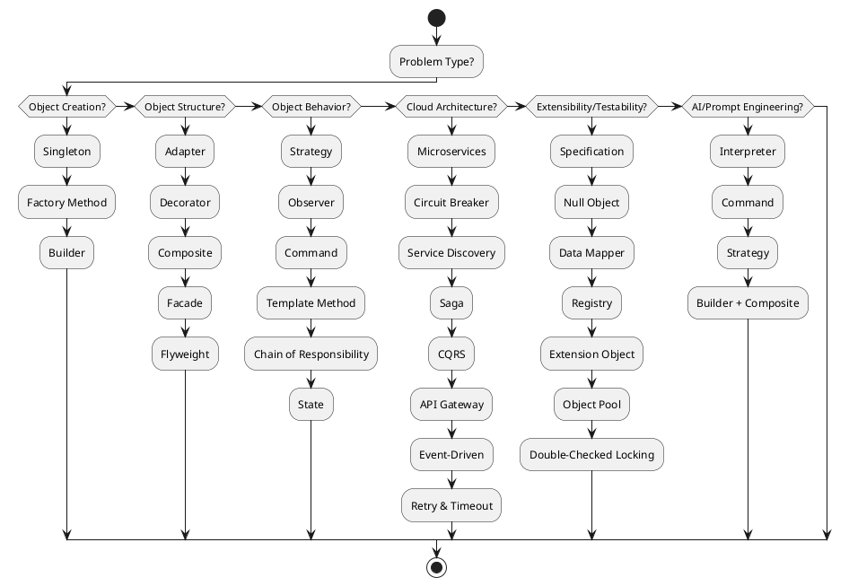

### ✅ **Must-Know Design Patterns**
These are foundational and frequently used across backend, frontend, and integration layers.

| Pattern | Category | Use Case |
|--------|----------|----------|
| **Singleton** | Creational | Ensure a class has only one instance (e.g., config manager, logging) |
| **Factory Method** | Creational | Delegate object instantiation to subclasses (e.g., DAO creation) |
| **Builder** | Creational | Construct complex objects step-by-step (e.g., DTOs, HTTP requests) |
| **Adapter** | Structural | Bridge incompatible interfaces (e.g., legacy system integration) |
| **Decorator** | Structural | Add responsibilities dynamically (e.g., request/response wrappers) |
| **Proxy** | Structural | Control access to objects (e.g., lazy loading, caching, security) |
| **Observer** | Behavioral | Event-driven systems (e.g., UI updates, pub-sub in microservices) |
| **Strategy** | Behavioral | Encapsulate interchangeable behaviors (e.g., sorting, validation) |
| **Template Method** | Behavioral | Define skeleton of an algorithm (e.g., workflow steps) |
| **Command** | Behavioral | Encapsulate requests as objects (e.g., undo/redo, job queues) |

---

### 🧠 **Should-Know Design Patterns**
These are more advanced or situational, but highly valuable in scalable systems and interview scenarios.

| Pattern | Category | Use Case |
|--------|----------|----------|
| **Composite** | Structural | Tree-like structures (e.g., UI components, menu systems) |
| **Facade** | Structural | Simplify complex subsystems (e.g., service orchestration) |
| **Flyweight** | Structural | Optimize memory usage (e.g., caching shared objects) |
| **Chain of Responsibility** | Behavioral | Request processing pipelines (e.g., middleware, filters) |
| **State** | Behavioral | Manage object behavior based on state (e.g., UI components, workflow engines) |
| **Memento** | Behavioral | Capture and restore object state (e.g., undo functionality) |
| **Interpreter** | Behavioral | Parse and evaluate expressions (e.g., DSLs, rule engines) |
| **Mediator** | Behavioral | Centralize communication (e.g., UI event handling, microservice coordination) |

---

### 🧩 Bonus: Architectural Patterns You Should Be Fluent In

| Pattern | Use Case |
|--------|----------|
| **MVC / MVVM** | Frontend and backend separation of concerns |
| **DAO / Repository** | Abstract data access logic |
| **Service Layer** | Encapsulate business logic |
| **DTO / VO** | Transfer structured data between layers |
| **Event Sourcing / CQRS** | Advanced state management in distributed systems |


### ☁️ **Must-Know Cloud Architecture Patterns**

| Pattern | Purpose | Example Use Case |
|--------|---------|------------------|
| **Microservices** | Decompose monoliths into independently deployable services | RESTful services with Spring Boot |
| **API Gateway** | Centralized entry point for APIs | Rate limiting, authentication, routing |
| **Circuit Breaker** | Prevent cascading failures | Resilience4j or Hystrix in service calls |
| **Service Discovery** | Locate services dynamically | Eureka, Consul, or Kubernetes DNS |
| **Sidecar** | Attach auxiliary tasks to services | Logging, monitoring, proxying |
| **Bulkhead** | Isolate failures in service partitions | Thread pools per service domain |
| **Retry & Timeout** | Handle transient failures gracefully | Spring Retry, Feign client configs |
| **Event-Driven Architecture** | Decouple services via messaging | Kafka, RabbitMQ, AWS SNS/SQS |
| **Strangler Fig** | Gradually replace legacy systems | Routing old endpoints to new services |
| **Autoscaling** | Adjust resources based on load | Kubernetes HPA, AWS EC2 Auto Scaling |


Absolutely, MANOJ. Let’s go beyond the surface and think like a systems architect who’s also hands-on with code. You already know the classics and cloud-native patterns—but there are **lesser-discussed yet highly impactful patterns** that often get overlooked in typical lists. These can elevate your design thinking, especially in **interview scenarios**, **enterprise-grade systems**, and **AI-integrated workflows**.

---

### 🔍 **Deep-Cut Design Patterns You Should Know**

#### 1. **Specification Pattern**
- **Purpose**: Encapsulates business rules and allows composition of complex predicates.
- **Use Case**: Dynamic filtering (e.g., JPA Criteria API, search queries).
- **Why It Matters**: Promotes clean separation of concerns between business logic and data access.

#### 2. **Null Object Pattern**
- **Purpose**: Avoids null checks by providing a default behavior.
- **Use Case**: Optional services, fallback strategies.
- **Why It Matters**: Reduces boilerplate and improves code safety.

#### 3. **Object Pool Pattern**
- **Purpose**: Reuse expensive-to-create objects.
- **Use Case**: Thread pools, database connections.
- **Why It Matters**: Boosts performance in high-concurrency environments.

#### 4. **Double-Checked Locking**
- **Purpose**: Optimize lazy initialization in multithreaded contexts.
- **Use Case**: Singleton instantiation with concurrency control.
- **Why It Matters**: Balances thread safety and performance.

#### 5. **Extension Object Pattern**
- **Purpose**: Add new behavior to objects without modifying them.
- **Use Case**: Plugin architectures, extensible APIs.
- **Why It Matters**: Supports open/closed principle in evolving systems.

#### 6. **Data Mapper Pattern**
- **Purpose**: Isolate domain logic from database access.
- **Use Case**: ORM frameworks like Hibernate.
- **Why It Matters**: Clean domain modeling and testability.

#### 7. **Registry Pattern**
- **Purpose**: Centralized access to shared objects.
- **Use Case**: Service locators, configuration managers.
- **Why It Matters**: Simplifies dependency management in large systems.

---

### 🧠 **Meta-Patterns and Hybrid Approaches**

These aren’t patterns in the GoF sense, but they reflect **how patterns evolve in real-world systems**:

- **Policy Pattern**: A variation of Strategy used for authorization and rules engines.
- **Reactive Pattern**: Combines Observer, Iterator, and Command for async data flows (e.g., Project Reactor).
- **Pipeline Pattern**: Chain of Responsibility + Command for stream processing (e.g., ETL, AI workflows).
- **Entity-Component-System (ECS)**: Popular in game engines, now emerging in UI frameworks and simulations.

---

### 🧩 **AI-Integrated Design Considerations**

Since you're refining prompts and building structured automation, consider:

- **Interpreter + Strategy** for prompt parsing and execution.
- **Command + Memento** for reversible AI actions.
- **Builder + Composite** for assembling multi-part AI responses or question sets.


### 🧠 **Should-Know Patterns for Advanced Cloud Design**

| Pattern | Purpose | Example Use Case |
|--------|---------|------------------|
| **Saga** | Manage distributed transactions | Order → Payment → Inventory workflows |
| **CQRS (Command Query Responsibility Segregation)** | Separate read/write models | High-performance data access layers |
| **Event Sourcing** | Persist state changes as events | Audit trails, rollback capabilities |
| **Fan-Out/Fan-In** | Parallelize tasks and aggregate results | Lambda functions or async workflows |
| **Sharding** | Split data across partitions | Horizontal scaling of databases |
| **Blue-Green Deployment** | Zero-downtime releases | Canary testing in production |
| **Immutable Infrastructure** | Replace rather than patch | Docker containers, Terraform provisioning |
| **Backend for Frontend (BFF)** | Tailor APIs to frontend needs | Separate APIs for web vs mobile clients |


## 🧭 Design Pattern Decision Tree

```plaintext
Start
│
├── Is the problem about object creation?
│   ├── Need one instance only → Singleton
│   ├── Need flexible instantiation → Factory Method / Abstract Factory
│   └── Need step-by-step construction → Builder
│
├── Is the problem about object structure?
│   ├── Need to wrap or extend behavior → Decorator
│   ├── Need to simplify interface → Facade
│   ├── Need to adapt incompatible interfaces → Adapter
│   ├── Need to treat group and individual uniformly → Composite
│   └── Need to share objects efficiently → Flyweight
│
├── Is the problem about object behavior?
│   ├── Need interchangeable algorithms → Strategy
│   ├── Need to notify multiple objects → Observer
│   ├── Need to encapsulate requests → Command
│   ├── Need to define algorithm skeleton → Template Method
│   ├── Need to chain handlers → Chain of Responsibility
│   └── Need to manage state transitions → State
│
├── Is the problem about cloud-native architecture?
│   ├── Need service decomposition → Microservices
│   ├── Need fault tolerance → Circuit Breaker / Retry / Bulkhead
│   ├── Need async communication → Event-Driven / Saga / CQRS
│   ├── Need deployment flexibility → Blue-Green / Immutable Infra
│   └── Need API orchestration → API Gateway / BFF
│
└── Is the problem about domain modeling or testability?
    ├── Need to isolate domain logic → Data Mapper / DAO
    ├── Need to compose business rules → Specification
    ├── Need safe defaults → Null Object
    ├── Need extensibility → Extension Object
    └── Need centralized access → Registry
```

---

## ✅ Interview-Ready Design Pattern Checklist

| Goal | Patterns to Master | Notes |
|------|--------------------|-------|
| **Object Creation** | Singleton, Factory, Builder | Be ready to explain lazy loading and thread safety |
| **Structural Design** | Adapter, Decorator, Composite, Facade | Use real-world analogies (e.g., UI components, wrappers) |
| **Behavioral Logic** | Strategy, Observer, Command, Template | Know when to use inheritance vs composition |
| **Concurrency & Performance** | Object Pool, Double-Checked Locking, Bulkhead | Tie into Java thread pools and executor services |
| **Cloud Architecture** | Microservices, Circuit Breaker, Saga, CQRS | Map to Spring Cloud, Kubernetes, or AWS patterns |
| **Domain Modeling** | Specification, Data Mapper, Null Object | Show how these improve testability and SRP |
| **Extensibility** | Extension Object, Registry, Plugin | Useful in modular systems and plugin-based apps |
| **AI/Prompt Engineering** | Interpreter, Strategy, Command | Great for rule engines, prompt parsing, DSLs |

---
